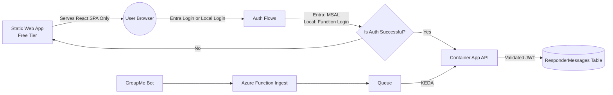
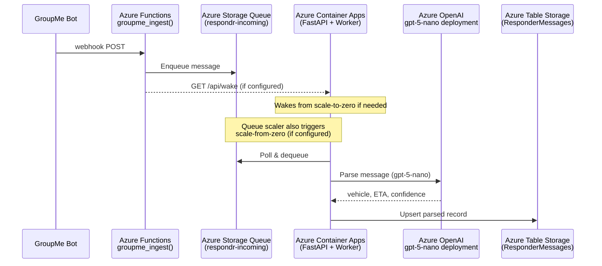
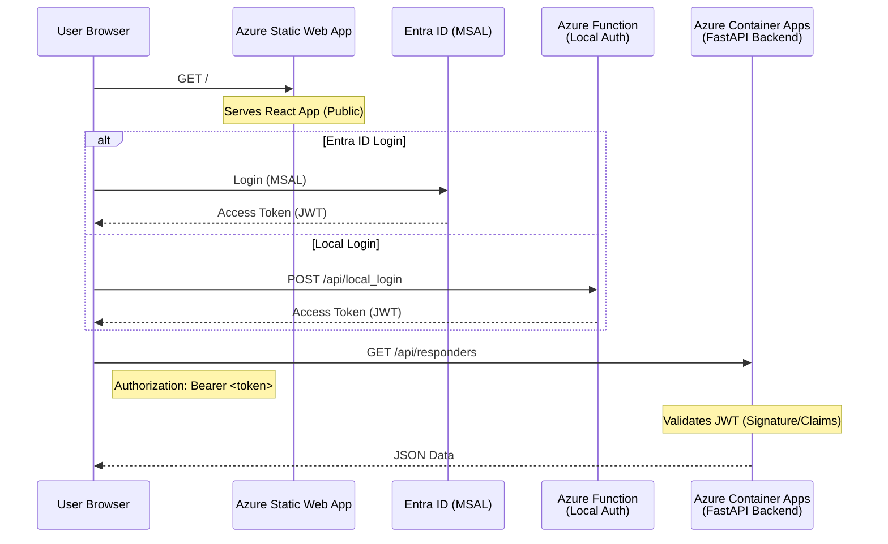

# Respondr Lite — SAR Response Tracker

A serverless web application to track responses to Search and Rescue call-outs. Built on Azure's consumption-based services for cost-efficient, scale-to-zero operation. The system listens to GroupMe webhooks, uses Azure OpenAI GPT-5-nano to extract responder details (vehicle and ETA), and displays data on a secure, real-time dashboard.

## Architecture Overview

This application has been completely refactored from Kubernetes to a lightweight, two-tier serverless architecture designed for **bot protection** and **scale-to-zero** cost efficiency:

- **Azure Functions** (Consumption): Handles GroupMe webhook ingestion and **local user authentication**.
- **Azure Static Web Apps** (Free): Hosts the React frontend on a global CDN with GitHub Actions CI/CD.
- **Azure Container Apps** (Consumption): Runs the FastAPI API + background workers. **Only wakes up for authenticated users or valid webhooks.**
- **Azure Storage Queue**: Decouples webhook ingestion from processing, enables auto-scaling.
- **Azure Table Storage**: Primary data store for responder messages and local users.
- **Azure OpenAI GPT-5-nano**: AI-powered message parsing for vehicle and ETA extraction.
- **Azure Entra ID (MSAL)**: Client-side authentication for organization users.

### High-Level Architecture



### Bot Protection & Scale-to-Zero

The architecture is strictly designed to prevent unauthorized traffic from waking the backend Container App:

1.  **Client-Side Auth**: Authentication happens entirely in the browser (Entra ID) or via Azure Functions (Local Auth).
2.  **Lazy Wake**: The Container App is only called *after* a user has a valid JWT.
3.  **Strict CORS**: The backend only accepts requests from the specific Static Web App domains.
4.  **No Public API**: Unauthenticated requests are rejected at the edge or by the API without processing.

## Quick Start

```powershell
# Run all automated tests
./run-tests.ps1

# Local development (backend + frontend)
./dev-local.ps1 -Full

# Deploy or re-deploy the cloud environment
cd deployment
./deploy-from-scratch.ps1 -ResourceGroup <rg-name> -Location <region>
cd ..
```

## Key Features

- **Cost-Optimized**: Scale-to-zero architecture with consumption-based billing
  - **Smart Frontend**: Landing page loads from Static Web App CDN without waking backend
  - **Lazy Backend Wake**: Container App only wakes when user authenticates or webhook arrives
  - **Session Persistence**: Uses session hints to minimize unnecessary backend calls
- **AI-Powered**: GPT-5-nano extracts vehicle and ETA from natural language messages
- **Dual Authentication**: Supports both Azure AD SSO and local accounts for external users
- **Real-Time Dashboard**: Live updates with responder status and arrival times
- **Admin Panel**: User management interface for local account administration
- **Webhook Debugger**: Built-in tool for testing GroupMe webhook integration
- **Multi-Tenant Support**: Domain-based allow list for organization access control
- **Soft Delete**: Recovery capability for accidentally deleted messages

### Message Processing Flow



### User Authentication Flow


## Application Endpoints

### Frontend (Azure Static Web App)

- **Dashboard**: `https://<your-static-web-app>.azurestaticapps.net/` — Main responder dashboard
- **Admin Panel**: `https://<your-static-web-app>.azurestaticapps.net/admin` — User management (admin only)
- **Webhook Debugger**: `https://<your-static-web-app>.azurestaticapps.net/webhook-debug` — Test webhook integration
- **Deleted Messages View**: `https://<your-static-web-app>.azurestaticapps.net/deleted-dashboard` — Soft-deleted responder records

> The React frontend calls the backend API through the `REACT_APP_API_URL` environment variable that is injected at build time by GitHub Actions.

### Backend API (Azure Container App)

- **Responder API**: `https://<your-container-app>.azurecontainerapps.io/api/responders`
- **Auth + Admin APIs**: `https://<your-container-app>.azurecontainerapps.io/api/*`
- **Health Check**: `https://<your-container-app>.azurecontainerapps.io/health`

### Ingestion Function

- **GroupMe Webhook**: `https://<function-app>.azurewebsites.net/api/groupme_ingest`

## Prerequisites

- Azure subscription with appropriate permissions
- Azure CLI (`az`) installed and configured
- PowerShell 7+ for deployment scripts
- Docker (for local development and container builds)
- **Azurite** (for local storage emulation) - Install via [VS Code Extension](https://marketplace.visualstudio.com/items?itemName=Azurite.azurite) or `npm install -g azurite`
- Python 3.11+ (for local development)
- Node.js 18+ (for frontend development)

## Deployment

### Prerequisites

Before deploying, ensure you have:

- **Azure subscription** with Owner or Contributor role
- **Azure CLI** installed and authenticated (`az login`)
- **PowerShell 7+** for deployment scripts
- **Docker Hub account** for hosting backend container images
- **GitHub repository** with this code (fork or clone)
- **GitHub Personal Access Token (PAT)** with `repo` scope for Static Web App deployment

### Step-by-Step Deployment Guide

#### 1. Prepare Environment Configuration

Copy the template and fill in your values:

```powershell
# Copy environment template
Copy-Item .env.template .env

# Edit with your values
code .env
```

**Required variables** (see [Environment Variables](#environment-variables) section for complete list):
- `ALLOWED_EMAIL_DOMAINS` - Your organization domain(s)
- `ALLOWED_ADMIN_USERS` - Admin email address(es)
- `ALLOWED_GROUPME_GROUP_IDS` - Comma-separated list of GroupMe Group IDs (Required for GroupMe integration)
- `WEBHOOK_API_KEY` - **Leave empty** for GroupMe integration (uses Azure Function key validation)

**Note**: Azure OpenAI and Storage connection strings will be populated after infrastructure deployment.

#### 2. Build and Push Backend Container

Run these commands from the **root** of the repository:

```powershell
# Build the Docker image
docker build -t <your-dockerhub-username>/respondr-lite:latest -f Dockerfile.backend .

# Login to Docker Hub
docker login

# Push the image
docker push <your-dockerhub-username>/respondr-lite:latest
```

Example:
```powershell
docker build -t jdoe/respondr-lite:latest -f Dockerfile.backend .
docker push jdoe/respondr-lite:latest
```

#### 3. Deploy Azure Infrastructure

```powershell
# Navigate to deployment directory
cd deployment

# Set your deployment parameters
$RESOURCE_GROUP = "respondr-prod"
$LOCATION = "eastus2"
$UNIQUE_ID = "myorg"  # Short identifier for unique resource names
$DOCKER_IMAGE = "docker.io/jdoe/respondr-lite:latest"
$GITHUB_REPO = "https://github.com/yourusername/respondr-lite"
$GITHUB_TOKEN = "<your-github-pat>"

# Create resource group
az group create --name $RESOURCE_GROUP --location $LOCATION

# Run deployment script
./deploy-from-scratch.ps1 `
  -UniqueId $UNIQUE_ID `
  -ResourceGroup $RESOURCE_GROUP `
  -Location $LOCATION `
  -ContainerImage $DOCKER_IMAGE `
  -RepositoryUrl $GITHUB_REPO `
  -RepositoryBranch "static" `
  -GithubToken $GITHUB_TOKEN
```

The script will deploy:
- Azure Storage Account (Queue + Table)
- Azure Functions (Python consumption plan)
- Azure Container Apps (FastAPI backend with scale-to-zero)
- Azure Static Web App (Free tier for frontend)
- Azure OpenAI (gpt-5-nano deployment)
- Log Analytics workspace
- RBAC role assignments for managed identity

**Save the deployment outputs** - you'll need these values:
- Container App URL: `https://respondr-<unique-id>.azurecontainerapps.io`
- Static Web App URL: `https://respondr-<unique-id>.azurestaticapps.net`
- Storage Connection String
- Azure OpenAI Endpoint and API Key
- Static Web App Deployment Token

#### 4. Deploy Azure Function Code

The infrastructure deployment creates the Function App resource, but you must deploy the code to it.

```powershell
# Navigate to functions directory
cd functions

# Install Azure Functions Core Tools if needed
# npm install -g azure-functions-core-tools@4

# Publish the function app
# Replace <function-app-name> with the name from the deployment output (e.g., respondr-func-myorg)
func azure functionapp publish <function-app-name>
```

#### 5. Update Environment Variables

The deployment script creates the resources but does not automatically inject sensitive secrets (like connection strings and API keys) into the Container App. You can use the helper script to fetch these values and update the app automatically:

```powershell
# Run the secrets helper
./deployment/get-secrets.ps1
```

This script will:
1. Auto-discover your resources in the resource group
2. Fetch the Storage Connection String and OpenAI Keys
3. Update the Container App environment variables

Alternatively, you can update them manually using the Azure CLI:

```powershell
# Get resource names from deployment
$CONTAINER_APP = "respondr-<unique-id>"
$STATIC_WEB_APP = "respondr-swa-<unique-id>"

# Update Container App environment variables
az containerapp update `
  --name $CONTAINER_APP `
  --resource-group $RESOURCE_GROUP `
  --set-env-vars `
    "AZURE_STORAGE_CONNECTION_STRING=<from-deployment-output>" `
    "AZURE_OPENAI_ENDPOINT=<from-deployment-output>" `
    "AZURE_OPENAI_API_KEY=<from-deployment-output>" `
    "AZURE_OPENAI_DEPLOYMENT=gpt-5-nano" `
    "WEBHOOK_API_KEY=<from-your-env>" `
    "STATIC_WEB_APP_URL=https://$STATIC_WEB_APP.azurestaticapps.net" `
    "ALLOWED_EMAIL_DOMAINS=<your-domains>" `
    "ALLOWED_ADMIN_USERS=<admin-emails>"
```

Update the Azure Function:

```powershell
$FUNCTION_APP = "respondr-func-<unique-id>"

az functionapp config appsettings set `
  --name $FUNCTION_APP `
  --resource-group $RESOURCE_GROUP `
  --settings `
    "AZURE_STORAGE_CONNECTION_STRING=<from-deployment-output>" `
    "STORAGE_QUEUE_NAME=respondr-incoming" `
    "WEBHOOK_API_KEY=<from-your-env>" `
    "CONTAINER_APP_WAKE_URL=https://$CONTAINER_APP.azurecontainerapps.io/api/wake"
```

#### 5. Configure GitHub Secrets and Variables

Navigate to your GitHub repository settings:

**Add Secrets** (`Settings` → `Secrets and variables` → `Actions` → `New repository secret`):

| Secret Name | Value | Purpose |
|-------------|-------|---------|
| `AZURE_STATIC_WEB_APPS_API_TOKEN` | Get with: `az staticwebapp secrets list -g <rg> -n <swa-name> --query properties.apiKey -o tsv` | Deploy frontend to Static Web App |
| `DOCKER_USERNAME` | Your Docker Hub username | Push backend images |
| `DOCKER_TOKEN` | Your Docker Hub access token | Authenticate Docker push |

**Add Variables** (`Settings` → `Secrets and variables` → `Actions` → `Variables` → `New repository variable`):

| Variable Name | Value | Purpose |
|---------------|-------|---------|
| `REACT_APP_API_URL` | `https://<container-app>.azurecontainerapps.io` | Frontend API endpoint |

#### 6. Deploy Frontend to Static Web App

The frontend deploys automatically via GitHub Actions when you push to the `static` branch:

```powershell
# Switch to static branch
git checkout static

# Ensure you have the latest changes
git pull origin static

# Push to trigger deployment
git push origin static
```

**Monitor the deployment**:
1. Go to your GitHub repository
2. Click the "Actions" tab
3. Watch the "Azure Static Web Apps CI/CD" workflow
4. Deployment typically takes 3-5 minutes

**Verify deployment**:
- Visit your Static Web App URL
- You should see the RespondrLite login page
- Check browser console (F12) for any errors

#### 7. Configure GroupMe Webhook

Get your webhook URL with the Function Key (code):

```powershell
# Get Function App hostname
$FUNCTION_HOST = az functionapp show `
  --name $FUNCTION_APP `
  --resource-group $RESOURCE_GROUP `
  --query defaultHostName -o tsv

# Get the Function Key (default)
$FUNC_KEY = az functionapp function keys list `
  --name $FUNCTION_APP `
  --resource-group $RESOURCE_GROUP `
  --function-name groupme_ingest `
  --query default -o tsv

# Construct webhook URL
$WEBHOOK_URL = "https://$FUNCTION_HOST/api/groupme_ingest?code=$FUNC_KEY"

Write-Host "Configure GroupMe bot callback URL to: $WEBHOOK_URL"
```

**In GroupMe**:
1. Go to https://dev.groupme.com/bots
2. Select your group or create a new bot
3. Set **Callback URL** to the URL above
4. Save

#### 8. Test the Deployment

**Test Authentication**:
1. Visit Static Web App URL
2. Click "Sign in with Microsoft"
3. Login with an account in your `ALLOWED_EMAIL_DOMAINS`
4. You should see the empty dashboard

**Test Webhook Processing**:
1. Send a test message in your GroupMe group:
   ```
   Responding SAR-78 ETA 30 min
   ```
2. Check Azure Portal → Container Apps → Log stream for processing logs
3. Refresh the dashboard - you should see the new responder entry

**Test Admin Features** (if you're in `ALLOWED_ADMIN_USERS`):
1. Login to the dashboard
2. Click "Admin Panel" tab
3. Test creating local users (if you enabled `ENABLE_LOCAL_AUTH`)

### Quick Deployment (Existing Infrastructure)

If you already have infrastructure and just need to update:

```powershell
# Update backend container
cd deployment
./build-push-docker.ps1 -Tag "latest"

# Update Container App
az containerapp update `
  --name <container-app-name> `
  --resource-group <resource-group> `
  --image docker.io/<username>/respondr-lite:latest

# Update frontend
git push origin static
```

### Teardown and Redeploy

To completely remove the environment:

```powershell
# WARNING: This permanently deletes all resources and data
az group delete -n <resource-group> --yes --no-wait
```

Wait for deletion to complete, then follow the deployment steps above to redeploy.

### Environment Variables

The application uses numerous environment variables for configuration. Below is a comprehensive reference table:

#### Core Configuration

| Variable | Description | Default | Required |
|----------|-------------|---------|----------|
| `TIMEZONE` | Application timezone | `America/Los_Angeles` | No |
| `RETENTION_DAYS` | Data retention period in days | `365` | No |

#### Authentication & Security

| Variable | Description | Default | Required |
|----------|-------------|---------|----------|
| `WEBHOOK_API_KEY` | Custom API key for webhook auth. **Leave empty for GroupMe** (uses Azure Function key). | - | No |
| `ALLOWED_EMAIL_DOMAINS` | Comma-separated allowed email domains | `scvsar.org,rtreit.com` | No |
| `ALLOWED_ADMIN_USERS` | Comma-separated admin user emails | - | No |
| `ALLOWED_GROUPME_GROUP_IDS` | Comma-separated allowed GroupMe group IDs. **Required if WEBHOOK_API_KEY is empty**. | - | Yes (for GroupMe) |
| `ENABLE_FUNCTION_PAYLOAD_LOGGING` | Enable logging of incoming payloads to table storage | `false` | No |
| `FUNCTION_PAYLOAD_TABLE` | Table name for function payload logs | `FunctionIncoming` | No |
| `DISABLE_API_KEY_CHECK` | Bypass API key validation (dev only) | `false` | No |

#### Local Authentication

| Variable | Description | Default | Required |
|----------|-------------|---------|----------|
| `ENABLE_LOCAL_AUTH` | Enable local JWT authentication | `false` | No |
| `LOCAL_AUTH_SECRET_KEY` | JWT token signing key | Random | If local auth enabled |
| `LOCAL_AUTH_SESSION_HOURS` | Session duration in hours | `24` | No |
| `LOCAL_USERS_TABLE` | Table name for local users | `LocalUsers` | No |
| `ALLOW_LOCAL_AUTH_BYPASS` | Allow auth bypass (dev only) | `false` | No |
| `LOCAL_BYPASS_IS_ADMIN` | Grant admin when bypassing | `false` | No |

#### Azure Storage

| Variable | Description | Default | Required |
|----------|-------------|---------|----------|
| `AZURE_STORAGE_CONNECTION_STRING` | Storage account connection string | - | Yes |
| `STORAGE_TABLE_NAME` | Table name for messages | `ResponderMessages` | No |
| `STORAGE_QUEUE_NAME` | Queue name for incoming messages | `RespondrIncoming` | No |
| `STORAGE_BACKEND` | Primary storage (`azure_table`, `file`, `memory`) | `azure_table` | No |
| `STORAGE_FALLBACK` | Fallback storage (`file`, `memory`) | `memory` | No |

#### Azure OpenAI

| Variable | Description | Default | Required |
|----------|-------------|---------|----------|
| `AZURE_OPENAI_ENDPOINT` | OpenAI service endpoint URL | - | Yes |
| `AZURE_OPENAI_API_KEY` | OpenAI API key | - | Yes |
| `AZURE_OPENAI_DEPLOYMENT` | Model deployment name | - | Yes |
| `AZURE_OPENAI_API_VERSION` | API version | `2024-12-01-preview` | No |

#### LLM Tuning

| Variable | Description | Default | Required |
|----------|-------------|---------|----------|
| `ENABLE_LLM_MOCK` | Enable mock LLM for offline dev | `false` | No |
| `DEFAULT_MAX_COMPLETION_TOKENS` | Default completion tokens | `1024` | No |
| `MIN_COMPLETION_TOKENS` | Minimum completion tokens | `128` | No |
| `MAX_COMPLETION_TOKENS_CAP` | Maximum completion tokens | `2048` | No |
| `LLM_MAX_RETRIES` | Max retry attempts | `3` | No |
| `LLM_TOKEN_INCREASE_FACTOR` | Token increase on retry | `1.5` | No |
| `LLM_REASONING_EFFORT` | Reasoning effort level | `medium` | No |
| `LLM_VERBOSITY` | Response verbosity | `low` | No |

#### Container & Scaling

| Variable | Description | Default | Required |
|----------|-------------|---------|----------|
| `CONTAINER_APP_WAKE_URL` | URL to wake Container App | - | No |

#### Frontend

| Variable | Description | Default | Required |
|----------|-------------|---------|----------|
| `REACT_APP_INACTIVITY_MINUTES` | Dashboard inactivity timeout | `10` | No |

#### Debug & Development

| Variable | Description | Default | Required |
|----------|-------------|---------|----------|
| `DEBUG` | Enable debug mode | `false` | No |
| `DEBUG_LOG_HEADERS` | Log HTTP headers | `false` | No |
| `DEBUG_FULL_LLM_LOG` | Full LLM logging | `false` | No |
| `ALLOW_CLEAR_ALL` | Allow clearing all messages | `false` | No |
| `ENABLE_REQUEST_LOGGING` | Log HTTP requests to Azure Table Storage | `false` | No |
| `REQUEST_LOG_TABLE` | Table name for request logs | `RequestLogs` | No |
| `FUNCTION_PAYLOAD_TABLE` | Table name for function payload logs | `FunctionIncoming` | No |

#### Theme & UI

| Variable | Description | Default | Required |
|----------|-------------|---------|----------|
| `FORCE_GEOCITIES_MODE` | Force retro GeoCities theme | `false` | No |
| `ENABLE_GEOCITIES_TOGGLE` | Enable theme toggle button | `false` | No |

### Example `.env` File

Create a `.env` file for local development:

```bash
# Azure Storage
AZURE_STORAGE_CONNECTION_STRING=<connection-string>
STORAGE_QUEUE_NAME=respondr-incoming
STORAGE_TABLE_NAME=ResponderMessages

# Azure OpenAI
AZURE_OPENAI_ENDPOINT=https://<your-instance>.openai.azure.com/
AZURE_OPENAI_API_KEY=<api-key>
AZURE_OPENAI_DEPLOYMENT=gpt-5-nano
AZURE_OPENAI_API_VERSION=2024-12-01-preview

# Authentication
WEBHOOK_API_KEY=
ALLOWED_GROUPME_GROUP_IDS=12345678,87654321
ALLOWED_EMAIL_DOMAINS=contoso.org,fabrikam.org
ALLOWED_ADMIN_USERS=admin@contoso.org

# Local Auth (optional)
ENABLE_LOCAL_AUTH=true
LOCAL_AUTH_SECRET_KEY=<secure-random-key>
LOCAL_AUTH_SESSION_HOURS=24

# Container Wake (for Azure Functions)
CONTAINER_APP_WAKE_URL=https://<your-container-app>.azurecontainerapps.io/api/wake

# Frontend Inactivity Detection
REACT_APP_INACTIVITY_MINUTES=10
```

### Custom Domains & TLS

Use the deployment scripts to manage TLS certificates for Azure Container Apps custom domains.

- `deployment/create-pfx-certificate.ps1`: generate self-signed certificates or a CSR for CA-issued certificates
- `deployment/configure-custom-domain.ps1`: upload the PFX, add the domain, and bind it to your Container App environment

```powershell
cd deployment

# Self-signed certificate for dev/testing
./create-pfx-certificate.ps1 -DomainName "respondr.scvsar.org" -SelfSigned

# Bind certificate and custom domain
./configure-custom-domain.ps1 `
    -ResourceGroup "respondrlite" `
    -ContainerAppName "respondr-lite" `
    -DomainName "respondr.scvsar.org" `
    -PfxFilePath "./certificates/respondr.scvsar.org.pfx"
```

Request a CA-signed certificate by running the CSR workflow (`-CreateCSR`) and combining the signed certificate with the generated key. Ensure your DNS CNAME points to the Container App FQDN before configuring the domain.


## Scale-to-Zero Configuration

### Container Wake Setup

The Azure Function can wake the Container App when new messages arrive:

1. **Set Environment Variable** in your Azure Function:
   ```
   CONTAINER_APP_WAKE_URL=https://your-container-app.azurecontainerapps.io/api/wake
   ```

2. **Wake Endpoints** (no authentication required):
   - `GET /api/wake`
   - `POST /api/wake`

### Inactivity Detection

The dashboard automatically pauses API calls after user inactivity:

- **Default timeout**: 10 minutes (configurable via `REACT_APP_INACTIVITY_MINUTES`)
- **Activity detection**: Mouse movement, clicks, keyboard input, scrolling
- **Visual indicator**: Shows "(Paused - Inactive)" in orange when paused
- **Auto-resume**: Any user interaction resumes live updates

This allows Azure Container Apps to scale to zero when truly idle, reducing costs while maintaining responsiveness for active users and new messages.

## Authentication

### Dual Authentication System

The application supports two authentication methods:

1. **Azure AD / Entra ID (SSO)**: For organization staff with Azure AD accounts
2. **Local Accounts**: For external users (deputies, volunteers) who cannot use SSO

### Azure AD Configuration

- Uses Azure AD "common" endpoint to accept users from any tenant
- Domain-based allow list via `ALLOWED_EMAIL_DOMAINS` environment variable
- Admin users specified via `ALLOWED_ADMIN_USERS` environment variable

### Local Authentication

Local accounts let you onboard deputies and other external responders alongside Entra ID. They live in Azure Table Storage and can run in parallel with SSO.

**Enable**

```bash
ENABLE_LOCAL_AUTH=true
LOCAL_AUTH_SECRET_KEY=<secure-random-key>
LOCAL_AUTH_SESSION_HOURS=24
LOCAL_USERS_TABLE=LocalUsers
```

Generate a strong secret with `python -c "import secrets; print(secrets.token_urlsafe(32))"`.

**Create users**

```bash
cd backend
python create_local_user.py admin admin@example.org "Admin User" --admin
python create_local_user.py deputy1 deputy1@sheriff.org "Deputy John" --organization "Sheriff Dept"
```

**Admin & self-service endpoints**
- Login: `POST /api/local_login` (Azure Function)
- Management: `/api/auth/local/change-password`, `/api/auth/local/me` (Backend)
- Admins: `/api/auth/local/admin/users`, `/api/auth/local/admin/create-user`, `/api/auth/local/admin/reset-password`

**Security defaults**
- PBKDF2 password hashing with per-user salts
- JWT session tokens (HS256)
- Login handled by Azure Function to prevent backend wake-ups

### Azure Entra ID Setup (Required for SSO)

To enable the "SCVSAR Member Login" button, you must register an application in your Azure Entra ID tenant.

1.  **Create App Registration**:
    *   Go to **Azure Portal** > **Microsoft Entra ID** > **App registrations** > **New registration**.
    *   **Name**: `Respondr Lite`.
    *   **Supported account types**: "Accounts in any organizational directory (Any Microsoft Entra ID tenant - Multitenant)".
    *   **Redirect URI**: Select **Single-page application (SPA)** and enter `http://localhost:3000` (for local dev) and your Static Web App URL (for production).
    *   Click **Register**.

2.  **Expose an API**:
    *   Go to **Expose an API** in the side menu.
    *   Click **Add** next to "Application ID URI" (accept the default `api://<client-id>`).
    *   Click **Add a scope**:
        *   **Scope name**: `access_as_user`
        *   **Who can consent?**: Admins and users
        *   **Display name**: Access Respondr Lite
        *   **Description**: Allows the app to access Respondr Lite APIs as the user.
        *   Click **Add scope**.

3.  **Configure API Permissions**:
    *   Go to **API permissions**.
    *   Click **Add a permission** > **My APIs** > Select your app (`Respondr Lite`).
    *   Select **Delegated permissions** > Check `access_as_user`.
    *   Click **Add permissions**.
    *   (Optional) Click **Grant admin consent** if you want to suppress consent prompts for your users.

4.  **Update Environment Variables**:
    *   Copy **Application (client) ID** and **Directory (tenant) ID** from the Overview page.
    *   Update `frontend/.env.local` (for local) or your Static Web App configuration (for prod):
        ```dotenv
        REACT_APP_AZURE_CLIENT_ID=<your-client-id>
        REACT_APP_AZURE_TENANT_ID=<your-tenant-id>
        REACT_APP_AZURE_SCOPES=api://<your-client-id>/access_as_user
        ```

## Performance Optimizations

### Preventing Unnecessary Backend Wake-Ups

The application is optimized to minimize Container App wake-ups and reduce costs:

**Frontend Optimizations**:
1.  **Landing Page**: The Static Web App serves the frontend from CDN without hitting the backend.
2.  **Auth Check Strategy**:
    *   Uses MSAL (Entra ID) or Local Auth (Azure Function) to authenticate *before* calling the backend.
    *   No calls to `/api/user` or other endpoints until a valid token is acquired.
3.  **Session Caching**:
    *   Tokens are cached in browser storage.
    *   Session hints prevent unauthenticated visitors from waking the backend.

**Backend Optimizations**:
1.  **Pure API**: Backend only serves API endpoints, no frontend file serving.
2.  **Wake Endpoint**: Dedicated `/api/wake` endpoint for Azure Functions to warm up the container.
3.  **CORS Configuration**: Strictly configured to allow only the specific Static Web App domains.

**Result**:
- Unauthenticated visitors to the landing page → **No backend wake** ✅
- Bot traffic scanning the site → **No backend wake** ✅
- Webhook arrives → **Function wakes backend** (intended behavior) ✅
- User logs in → **Backend wakes** (intended behavior) ✅

## New Features

### Admin Panel

Web-based interface for managing local user accounts:
- Create, update, and delete users
- Reset passwords
- Manage admin privileges
- View user activity

Access at: `https://<your-static-web-app>.azurestaticapps.net/admin` (admin authentication required)

### Webhook Debugger

Built-in tool for testing GroupMe webhook integration:
- Send test messages
- Override AI prompts for debugging
- View real-time processing results
- Test different message formats

Access at: `https://<your-static-web-app>.azurestaticapps.net/webhook-debug`


## Local Development

### Full Stack Development

The local development environment uses **Azurite** to emulate Azure Storage (Queues and Tables) locally, ensuring a self-contained offline workflow.

1. **Start Azurite**: Run "Azurite: Start" from the VS Code Command Palette or `azurite` in a terminal.
2. **Start Components**:

```bash
# Backend + Frontend + Functions with hot reload
./dev-local.ps1 -Interactive
```

This script will:
- Launch the **Azure Functions** (Ingest) on port 7071
- Launch the **Backend API** (Docker) on port 8000
- Launch the **Frontend** (React) on port 3000

### Offline Mode (Mock LLM)

If you do not have valid Azure OpenAI credentials, you can run the backend in "Offline Mode". This uses a mock LLM implementation that performs simple keyword matching to simulate vehicle and ETA extraction.

```bash
# Run in offline mode
./dev-local.ps1 -Offline
```

In this mode:
- **"Responding"** status is triggered by keywords like "eta", "omw", "en route".
- **"Not Responding"** status is triggered by "stand down", "cancel", "10-22".
- Simple vehicle names (e.g., "SAR-123") and ETAs (e.g., "10 min") are extracted.

### Frontend Scripts

```bash
cd frontend
npm start         # run the React dev server on http://localhost:3000
npm test          # run React tests in watch mode
npm run build     # create a production build
```

### Testing

```bash
# Run all tests
./run-tests.ps1

# Backend tests only
cd backend
python run_tests.py

# Frontend tests only
cd frontend
npm test

# Integration tests
cd functions/tests
python test_integration_groupme_ingest.py
```

### Mission Simulator

Generate realistic SAR mission traffic to validate scaling, cost, and AI parsing.

**Highlights**
- Snohomish County mission templates with authentic responder behaviour and timing
- GPT-5-nano generated GroupMe-style messages across initial, follow-up, and late phases
- Drives the live webhook pipeline so you can observe end-to-end behaviour

**Setup**

```bash
cd simulator
cp .env.example .env    # supply Azure Function endpoint and API key
pip install -r requirements.txt
```

**Run modes**

```bash
python mission_simulator.py --dry-run        # print planned messages without sending
python mission_simulator.py --force-mission  # start a mission immediately
python mission_simulator.py                  # respect the normal 48h cadence
```

The simulator targets a PreProd GroupMe group by default so you can test safely; update the configuration before sending traffic to production channels.

## CI/CD with GitHub Actions

Three workflows orchestrate automated testing and deployments:

| Workflow | Trigger | What it does |
|----------|---------|--------------|
| `.github/workflows/ci.yml` | PRs to `main`, pushes to `main` | Runs backend + frontend tests. On `main` pushes it builds and pushes the backend image to Docker Hub and (optionally) deploys the `main` image to production Container Apps. |
| `.github/workflows/deploy-preprod.yml` | Pushes to `preprod` | Runs full test matrix, builds a tagged backend image, and updates the preproduction Container App using Azure OIDC credentials. |
| `.github/workflows/azure-swa-deploy.yml` | PRs/pushes touching `frontend/` on `main` or `preprod` | Builds the React app and uploads it to the Static Web App. Requires the `AZURE_STATIC_WEB_APPS_API_TOKEN` secret and the `REACT_APP_API_URL` repository variable. |

Use `./.github/workflows/setup-github-actions.ps1` to create the Azure service principal and seed the required secrets/variables from the CLI.

### Manual container deployments (optional)

If you need to push the backend image manually:

```bash
docker build -t myregistry.azurecr.io/respondr:latest .
docker push myregistry.azurecr.io/respondr:latest

az containerapp update \
  --name respondr-app \
  --resource-group respondr-rg \
  --image myregistry.azurecr.io/respondr:latest
```

## Monitoring and Operations

### Health Monitoring

- **Application Health**: `https://<your-container-app>.azurecontainerapps.io/health` - Returns application status
- **Queue Metrics**: Monitor via Azure Portal → Storage Account → Queue metrics
- **Container App Logs**: View in Azure Portal → Container App → Log stream
- **Function Logs**: Azure Portal → Function App → Monitor → Logs

### Troubleshooting

Common issues and solutions:

**GroupMe webhook not receiving messages:**
- Verify `WEBHOOK_API_KEY` matches between Function and GroupMe bot
- Check Function App logs for authentication errors
- Ensure Function URL is correctly configured in GroupMe bot

**Messages not appearing in dashboard:**
- Check Storage Queue for message backlog
- Verify Container App is running (may need manual start if scaled to zero)
- Review Container App logs for processing errors

**Authentication issues:**
- For SSO: Verify Azure AD app registration and redirect URIs
- For local auth: Check `ENABLE_LOCAL_AUTH` and `LOCAL_AUTH_SECRET_KEY` are set
- Ensure allowed domains/users are correctly configured

**AI parsing errors:**
- Verify Azure OpenAI endpoint and API key
- Check GPT-5-nano deployment is active
- Review message format in webhook debugger

## Data Management

### Soft Delete and Recovery

Deletes in the UI are "soft deletes" - data is moved to a separate partition for recovery:

- **Active messages**: Stored in main partition
- **Deleted messages**: Moved to `deleted` partition with timestamp

Recovery endpoints:
- `GET /api/deleted-responders` - List deleted messages
- `POST /api/deleted-responders/undelete` - Restore messages
- `DELETE /api/deleted-responders/{id}` - Permanently delete

Access deleted items at: `https://<your-static-web-app>.azurestaticapps.net/deleted-dashboard`

### Data Retention

- Messages older than 365 days are automatically purged (configurable via `RETENTION_DAYS`)
- Deleted items are retained separately and must be manually purged

## How It Works

### Message Processing Flow

1. **GroupMe sends webhook** to Azure Function endpoint
2. **Function validates** API key and enqueues message to Storage Queue
3. **Queue triggers** Container App to scale from zero
4. **Background worker** polls queue and processes messages:
   - Extracts text from GroupMe message
   - Calls GPT-5-nano to parse vehicle and ETA
   - Normalizes time information
   - Stores in Azure Table Storage
5. **Dashboard updates** in real-time with new responder data

### AI Message Parsing

GPT-5-nano processes natural language messages to extract:
- **Vehicle**: SAR unit number, POV, or Unknown
- **ETA**: Normalized to HH:MM format
- **Status**: Computed arrival status based on current time
- **Confidence**: AI confidence level in parsing

Example transformations:
- "Responding SAR-78, ETA 25" → Vehicle: "SAR-78", ETA: "14:25"
- "Taking POV, be there in 45 min" → Vehicle: "POV", ETA: "14:45"
- "On my way" → Vehicle: "Unknown", ETA: null

## Cost Optimization

This serverless architecture minimizes costs through:

- **Scale-to-zero**: All components scale down when idle
- **Consumption billing**: Pay only for actual usage
- **No infrastructure overhead**: No VMs, load balancers, or always-on services
- **Efficient resource usage**: Queue-based processing prevents over-provisioning

Typical monthly costs (low usage):
- Azure Functions: ~$0 (free tier covers most scenarios)
- Container Apps: ~$5-10 (scales to zero when idle)
- Storage: ~$1-2 (minimal data storage)
- Azure OpenAI: Usage-based (~$0.001 per message)

## Security Considerations

- **API Key Protection**: Webhook API keys stored securely in environment variables
- **Managed Identity**: Preferred over connection strings for Azure service access
- **HTTPS Only**: All endpoints use TLS encryption
- **Input Validation**: Comprehensive validation on all inputs
- **Rate Limiting**: Built-in protection against abuse
- **Audit Logging**: All authentication and data modification events logged

## Migration from Kubernetes

If migrating from the original Kubernetes-based deployment:

1. **Export existing data** from Redis/previous storage
2. **Deploy new infrastructure** using deployment scripts
3. **Import data** to Azure Table Storage
4. **Update GroupMe bot** webhook URL to Function endpoint
5. **Verify processing** with webhook debugger
6. **Decommission old infrastructure** once validated

## Support and Documentation

- **Architecture Details**: See [docs/serverless-refactor-brief.md](docs/serverless-refactor-brief.md)
- **Deployment Scripts**: See [deployment/](deployment/) directory

## Contributing

1. Fork the repository
2. Create a feature branch
3. Make changes and test locally
4. Ensure all tests pass
5. Open a pull request

## License

MIT — see [LICENSE](LICENSE) file for details.

