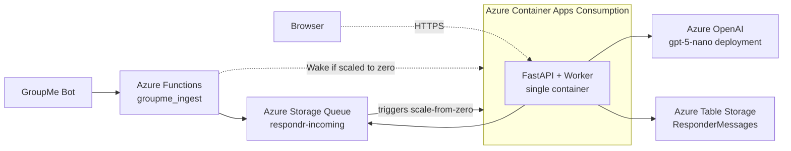

# Respondr Lite — SAR Response Tracker

A serverless web application to track responses to Search and Rescue call-outs. Built on Azure's consumption-based services for cost-efficient, scale-to-zero operation. The system listens to GroupMe webhooks, uses Azure OpenAI GPT-5-nano to extract responder details (vehicle and ETA), and displays data on a secure, real-time dashboard.

## Architecture Overview

This application has been completely refactored from Kubernetes to a lightweight serverless architecture:

- **Azure Functions** (Consumption): Handles GroupMe webhook ingestion and message queuing
- **Azure Container Apps** (Consumption): Runs the FastAPI backend + React frontend with scale-to-zero capability
- **Azure Storage Queue**: Decouples webhook ingestion from processing, enables auto-scaling
- **Azure Table Storage**: Primary data store for responder messages
- **Azure OpenAI GPT-5-nano**: AI-powered message parsing for vehicle and ETA extraction
- **Azure Entra ID (Easy Auth)**: Built-in authentication replacing OAuth2 proxy sidecar

### High-Level Architecture



## Quick Start

```bash
# Run tests
./run-tests.ps1

# Local development (backend + frontend)
./dev-local.ps1 -Full

# Deploy complete infrastructure
cd deployment
./deploy-from-scratch.ps1 -ResourceGroup <rg-name> -Location <region>
```

## Key Features

- **Cost-Optimized**: Scale-to-zero architecture with consumption-based billing
- **AI-Powered**: GPT-5-nano extracts vehicle and ETA from natural language messages
- **Dual Authentication**: Supports both Azure AD SSO and local accounts for external users
- **Real-Time Dashboard**: Live updates with responder status and arrival times
- **Admin Panel**: User management interface for local account administration
- **Webhook Debugger**: Built-in tool for testing GroupMe webhook integration
- **Multi-Tenant Support**: Domain-based allow list for organization access control
- **Soft Delete**: Recovery capability for accidentally deleted messages

### Message Processing Flow


### User Authentication Flow


## Application Endpoints

The Container App exposes these endpoints:

- **Dashboard**: `https://<your-app>.azurecontainerapps.io/` - Main responder dashboard
- **API**: `https://<your-app>.azurecontainerapps.io/api/responders` - RESTful API for responder data
- **Admin Panel**: `https://<your-app>.azurecontainerapps.io/admin` - User management (admin only)
- **Webhook Debugger**: `https://<your-app>.azurecontainerapps.io/webhook-debug` - Test webhook integration
- **Health Check**: `https://<your-app>.azurecontainerapps.io/health` - Application health status

The Azure Function exposes:
- **GroupMe Webhook**: `https://<function-app>.azurewebsites.net/api/groupme_ingest` - Receives GroupMe messages

## Prerequisites

- Azure subscription with appropriate permissions
- Azure CLI (`az`) installed and configured
- PowerShell 7+ for deployment scripts
- Docker (for local development and container builds)
- Python 3.11+ (for local development)
- Node.js 18+ (for frontend development)

## Deployment

### Complete Infrastructure Deployment

Deploy all resources with a single command:

```powershell
cd deployment
./deploy-from-scratch.ps1 `
  -ResourceGroup "respondr-rg" `
  -Location "eastus2"
```

This script will:
1. Create a resource group
2. Deploy Azure Storage (Queue + Table)
3. Deploy Azure Functions for webhook ingestion
4. Deploy Azure OpenAI with GPT-5-nano model
5. Deploy Azure Container Apps with auto-scaling rules
6. Configure authentication (optional)
7. Output connection details and endpoints

### Configuration Options

The deployment script supports these parameters:

```powershell
./deploy-from-scratch.ps1 `
  -ResourceGroup "respondr-rg" `
  -Location "eastus2" `
  -ContainerImage "myregistry.azurecr.io/respondr:latest" `
  -EnableAuth $true `
  -AuthClientId "<azure-ad-app-id>" `
  -AuthClientSecret "<azure-ad-app-secret>"
```

### Environment Variables

The application uses numerous environment variables for configuration. Below is a comprehensive reference table:

#### Core Configuration

| Variable | Description | Default | Required |
|----------|-------------|---------|----------|
| `TIMEZONE` | Application timezone | `America/Los_Angeles` | No |
| `RETENTION_DAYS` | Data retention period in days | `365` | No |

#### Authentication & Security

| Variable | Description | Default | Required |
|----------|-------------|---------|----------|
| `WEBHOOK_API_KEY` | API key for GroupMe webhook authentication | - | Yes |
| `ALLOWED_EMAIL_DOMAINS` | Comma-separated allowed email domains | `scvsar.org,rtreit.com` | No |
| `ALLOWED_ADMIN_USERS` | Comma-separated admin user emails | - | No |
| `ALLOWED_GROUPME_GROUP_IDS` | Comma-separated allowed GroupMe group IDs | - | No |
| `ENABLE_FUNCTION_PAYLOAD_LOGGING` | Enable logging of incoming payloads to table storage | `false` | No |
| `FUNCTION_PAYLOAD_TABLE` | Table name for function payload logs | `FunctionIncoming` | No |
| `DISABLE_API_KEY_CHECK` | Bypass API key validation (dev only) | `false` | No |

#### Local Authentication

| Variable | Description | Default | Required |
|----------|-------------|---------|----------|
| `ENABLE_LOCAL_AUTH` | Enable local JWT authentication | `false` | No |
| `LOCAL_AUTH_SECRET_KEY` | JWT token signing key | Random | If local auth enabled |
| `LOCAL_AUTH_SESSION_HOURS` | Session duration in hours | `24` | No |
| `LOCAL_USERS_TABLE` | Table name for local users | `LocalUsers` | No |
| `ALLOW_LOCAL_AUTH_BYPASS` | Allow auth bypass (dev only) | `false` | No |
| `LOCAL_BYPASS_IS_ADMIN` | Grant admin when bypassing | `false` | No |

#### Azure Storage

| Variable | Description | Default | Required |
|----------|-------------|---------|----------|
| `AZURE_STORAGE_CONNECTION_STRING` | Storage account connection string | - | Yes |
| `STORAGE_TABLE_NAME` | Table name for messages | `ResponderMessages` | No |
| `STORAGE_QUEUE_NAME` | Queue name for incoming messages | `RespondrIncoming` | No |
| `STORAGE_BACKEND` | Primary storage backend | `azure_table` | No |
| `STORAGE_FALLBACK` | Fallback storage backend | `memory` | No |

#### Azure OpenAI

| Variable | Description | Default | Required |
|----------|-------------|---------|----------|
| `AZURE_OPENAI_ENDPOINT` | OpenAI service endpoint URL | - | Yes |
| `AZURE_OPENAI_API_KEY` | OpenAI API key | - | Yes |
| `AZURE_OPENAI_DEPLOYMENT` | Model deployment name | - | Yes |
| `AZURE_OPENAI_API_VERSION` | API version | `2024-12-01-preview` | No |

#### LLM Tuning

| Variable | Description | Default | Required |
|----------|-------------|---------|----------|
| `DEFAULT_MAX_COMPLETION_TOKENS` | Default completion tokens | `1024` | No |
| `MIN_COMPLETION_TOKENS` | Minimum completion tokens | `128` | No |
| `MAX_COMPLETION_TOKENS_CAP` | Maximum completion tokens | `2048` | No |
| `LLM_MAX_RETRIES` | Max retry attempts | `3` | No |
| `LLM_TOKEN_INCREASE_FACTOR` | Token increase on retry | `1.5` | No |
| `LLM_REASONING_EFFORT` | Reasoning effort level | `medium` | No |
| `LLM_VERBOSITY` | Response verbosity | `low` | No |

#### Container & Scaling

| Variable | Description | Default | Required |
|----------|-------------|---------|----------|
| `CONTAINER_APP_WAKE_URL` | URL to wake Container App | - | No |

#### Frontend

| Variable | Description | Default | Required |
|----------|-------------|---------|----------|
| `REACT_APP_INACTIVITY_MINUTES` | Dashboard inactivity timeout | `10` | No |

#### Debug & Development

| Variable | Description | Default | Required |
|----------|-------------|---------|----------|
| `DEBUG` | Enable debug mode | `false` | No |
| `DEBUG_LOG_HEADERS` | Log HTTP headers | `false` | No |
| `DEBUG_FULL_LLM_LOG` | Full LLM logging | `false` | No |
| `ALLOW_CLEAR_ALL` | Allow clearing all messages | `false` | No |
| `ENABLE_REQUEST_LOGGING` | Log HTTP requests to Azure Table Storage | `false` | No |
| `REQUEST_LOG_TABLE` | Table name for request logs | `RequestLogs` | No |
| `FUNCTION_PAYLOAD_TABLE` | Table name for function payload logs | `FunctionIncoming` | No |

#### Theme & UI

| Variable | Description | Default | Required |
|----------|-------------|---------|----------|
| `FORCE_GEOCITIES_MODE` | Force retro GeoCities theme | `false` | No |
| `ENABLE_GEOCITIES_TOGGLE` | Enable theme toggle button | `false` | No |

### Example `.env` File

Create a `.env` file for local development:

```bash
# Azure Storage
AZURE_STORAGE_CONNECTION_STRING=<connection-string>
STORAGE_QUEUE_NAME=respondr-incoming
STORAGE_TABLE_NAME=ResponderMessages

# Azure OpenAI
AZURE_OPENAI_ENDPOINT=https://<your-instance>.openai.azure.com/
AZURE_OPENAI_API_KEY=<api-key>
AZURE_OPENAI_DEPLOYMENT=gpt-5-nano
AZURE_OPENAI_API_VERSION=2024-12-01-preview

# Authentication
WEBHOOK_API_KEY=<secure-random-key>
ALLOWED_EMAIL_DOMAINS=contoso.org,fabrikam.org
ALLOWED_ADMIN_USERS=admin@contoso.org

# Local Auth (optional)
ENABLE_LOCAL_AUTH=true
LOCAL_AUTH_SECRET_KEY=<secure-random-key>
LOCAL_AUTH_SESSION_HOURS=24

# Container Wake (for Azure Functions)
CONTAINER_APP_WAKE_URL=https://<your-app>.azurecontainerapps.io/api/wake

# Frontend Inactivity Detection
REACT_APP_INACTIVITY_MINUTES=10
```

## Scale-to-Zero Configuration

### Container Wake Setup

The Azure Function can wake the Container App when new messages arrive:

1. **Set Environment Variable** in your Azure Function:
   ```
   CONTAINER_APP_WAKE_URL=https://your-container-app.azurecontainerapps.io/api/wake
   ```

2. **Wake Endpoints** (no authentication required):
   - `GET /api/wake`
   - `POST /api/wake`

### Inactivity Detection

The dashboard automatically pauses API calls after user inactivity:

- **Default timeout**: 10 minutes (configurable via `REACT_APP_INACTIVITY_MINUTES`)
- **Activity detection**: Mouse movement, clicks, keyboard input, scrolling
- **Visual indicator**: Shows "(Paused - Inactive)" in orange when paused
- **Auto-resume**: Any user interaction resumes live updates

This allows Azure Container Apps to scale to zero when truly idle, reducing costs while maintaining responsiveness for active users and new messages.

## Authentication

### Dual Authentication System

The application supports two authentication methods:

1. **Azure AD / Entra ID (SSO)**: For organization staff with Azure AD accounts
2. **Local Accounts**: For external users (deputies, volunteers) who cannot use SSO

### Azure AD Configuration

- Uses Azure AD "common" endpoint to accept users from any tenant
- Domain-based allow list via `ALLOWED_EMAIL_DOMAINS` environment variable
- Admin users specified via `ALLOWED_ADMIN_USERS` environment variable

### Local Authentication

Enable local authentication for external users:

```bash
# Enable in environment
ENABLE_LOCAL_AUTH=true
LOCAL_AUTH_SECRET_KEY=<secure-random-key>

# Create admin user
cd backend
python create_local_user.py admin admin@example.org "Admin User" --admin

# Create regular user
python create_local_user.py deputy1 deputy1@sheriff.org "Deputy John" --organization "Sheriff Dept"
```

See [LOCAL_AUTH_README.md](LOCAL_AUTH_README.md) for detailed setup instructions.

## New Features

### Admin Panel

Web-based interface for managing local user accounts:
- Create, update, and delete users
- Reset passwords
- Manage admin privileges
- View user activity

Access at: `https://<your-app>/admin` (admin authentication required)

### Webhook Debugger

Built-in tool for testing GroupMe webhook integration:
- Send test messages
- Override AI prompts for debugging
- View real-time processing results
- Test different message formats

Access at: `https://<your-app>/webhook-debug`


## Local Development

### Full Stack Development

```bash
# Backend + Frontend with hot reload
./dev-local.ps1 -Full

# Backend only
./dev-local.ps1

# Using Docker Compose
./dev-local.ps1 -Docker
```

### Testing

```bash
# Run all tests
./run-tests.ps1

# Backend tests only
cd backend
python run_tests.py

# Frontend tests only
cd frontend
npm test

# Integration tests
cd functions/tests
python test_integration_groupme_ingest.py
```

### Mission Simulator

For testing Azure infrastructure costs and performance under realistic SAR mission load:

```bash
# Navigate to simulator
cd simulator

# Copy configuration template
cp .env.example .env
# Edit .env with your actual Azure Function endpoint and API key

# Install dependencies
pip install -r requirements.txt

# Test simulation (dry run)
python mission_simulator.py --dry-run --force-mission

# Run real simulation against your environment
python mission_simulator.py --force-mission
```

See `simulator/README.md` for detailed documentation.

## CI/CD with GitHub Actions

The repository includes GitHub Actions workflows for automated testing and deployment:

### Workflows

- **Pull Requests**: Runs backend tests automatically
- **Main Branch**: Builds and pushes Docker images to registry

### Container Registry Integration

For automatic deployments when using Azure Container Registry:

1. Build and push your image:
```bash
docker build -t myregistry.azurecr.io/respondr:latest .
docker push myregistry.azurecr.io/respondr:latest
```

2. Update Container App with new image:
```bash
az containerapp update \
  --name respondr-app \
  --resource-group respondr-rg \
  --image myregistry.azurecr.io/respondr:latest
```

## Monitoring and Operations

### Health Monitoring

- **Application Health**: `https://<your-app>/health` - Returns application status
- **Queue Metrics**: Monitor via Azure Portal → Storage Account → Queue metrics
- **Container App Logs**: View in Azure Portal → Container App → Log stream
- **Function Logs**: Azure Portal → Function App → Monitor → Logs

### Troubleshooting

Common issues and solutions:

**GroupMe webhook not receiving messages:**
- Verify `WEBHOOK_API_KEY` matches between Function and GroupMe bot
- Check Function App logs for authentication errors
- Ensure Function URL is correctly configured in GroupMe bot

**Messages not appearing in dashboard:**
- Check Storage Queue for message backlog
- Verify Container App is running (may need manual start if scaled to zero)
- Review Container App logs for processing errors

**Authentication issues:**
- For SSO: Verify Azure AD app registration and redirect URIs
- For local auth: Check `ENABLE_LOCAL_AUTH` and `LOCAL_AUTH_SECRET_KEY` are set
- Ensure allowed domains/users are correctly configured

**AI parsing errors:**
- Verify Azure OpenAI endpoint and API key
- Check GPT-5-nano deployment is active
- Review message format in webhook debugger

## Data Management

### Soft Delete and Recovery

Deletes in the UI are "soft deletes" - data is moved to a separate partition for recovery:

- **Active messages**: Stored in main partition
- **Deleted messages**: Moved to `deleted` partition with timestamp

Recovery endpoints:
- `GET /api/deleted-responders` - List deleted messages
- `POST /api/deleted-responders/undelete` - Restore messages
- `DELETE /api/deleted-responders/{id}` - Permanently delete

Access deleted items at: `https://<your-app>/deleted-dashboard`

### Data Retention

- Messages older than 365 days are automatically purged (configurable via `RETENTION_DAYS`)
- Deleted items are retained separately and must be manually purged

## How It Works

### Message Processing Flow

1. **GroupMe sends webhook** to Azure Function endpoint
2. **Function validates** API key and enqueues message to Storage Queue
3. **Queue triggers** Container App to scale from zero
4. **Background worker** polls queue and processes messages:
   - Extracts text from GroupMe message
   - Calls GPT-5-nano to parse vehicle and ETA
   - Normalizes time information
   - Stores in Azure Table Storage
5. **Dashboard updates** in real-time with new responder data

### AI Message Parsing

GPT-5-nano processes natural language messages to extract:
- **Vehicle**: SAR unit number, POV, or Unknown
- **ETA**: Normalized to HH:MM format
- **Status**: Computed arrival status based on current time
- **Confidence**: AI confidence level in parsing

Example transformations:
- "Responding SAR-78, ETA 25" → Vehicle: "SAR-78", ETA: "14:25"
- "Taking POV, be there in 45 min" → Vehicle: "POV", ETA: "14:45"
- "On my way" → Vehicle: "Unknown", ETA: null

## Cost Optimization

This serverless architecture minimizes costs through:

- **Scale-to-zero**: All components scale down when idle
- **Consumption billing**: Pay only for actual usage
- **No infrastructure overhead**: No VMs, load balancers, or always-on services
- **Efficient resource usage**: Queue-based processing prevents over-provisioning

Typical monthly costs (low usage):
- Azure Functions: ~$0 (free tier covers most scenarios)
- Container Apps: ~$5-10 (scales to zero when idle)
- Storage: ~$1-2 (minimal data storage)
- Azure OpenAI: Usage-based (~$0.001 per message)

## Security Considerations

- **API Key Protection**: Webhook API keys stored securely in environment variables
- **Managed Identity**: Preferred over connection strings for Azure service access
- **HTTPS Only**: All endpoints use TLS encryption
- **Input Validation**: Comprehensive validation on all inputs
- **Rate Limiting**: Built-in protection against abuse
- **Audit Logging**: All authentication and data modification events logged

## Migration from Kubernetes

If migrating from the original Kubernetes-based deployment:

1. **Export existing data** from Redis/previous storage
2. **Deploy new infrastructure** using deployment scripts
3. **Import data** to Azure Table Storage
4. **Update GroupMe bot** webhook URL to Function endpoint
5. **Verify processing** with webhook debugger
6. **Decommission old infrastructure** once validated

## Support and Documentation

- **Architecture Details**: See [docs/serverless-refactor-brief.md](docs/serverless-refactor-brief.md)
- **Local Auth Setup**: See [LOCAL_AUTH_README.md](LOCAL_AUTH_README.md)
- **Storage Configuration**: See [backend/STORAGE_CONFIG.md](backend/STORAGE_CONFIG.md)
- **Deployment Scripts**: See [deployment/](deployment/) directory

## Contributing

1. Fork the repository
2. Create a feature branch
3. Make changes and test locally
4. Ensure all tests pass
5. Open a pull request

## License

MIT — see [LICENSE](LICENSE) file for details.