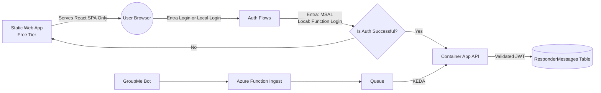

# Respondr Lite — Minimal-Cost Auth Architecture (SWA Free + Container App + Functions)

## Purpose

This document defines the **minimal-cost**, **bot-resistant**, **scale-to-zero** authentication and access model for Respondr Lite.

The goal is to ensure the **Azure Container App** (backend API + worker) **only wakes** under two legitimate conditions:

1. **A SAR mission starts**  
   (GroupMe → Azure Function → Storage Queue → KEDA wake)

2. **A real human successfully authenticates**  
   (Entra ID SSO or local account login)

All other traffic — especially **bot login attempts**, scanners, or anonymous visitors — should **never** wake the Container App.

This architecture is compatible with:

- **Azure Static Web Apps — Free Tier** (React SPA only)  
- **Azure Container Apps — Consumption** (FastAPI API + workers)  
- **Azure Functions — Consumption** (webhook + local-login)

Total fixed monthly cost: **≈ $0**, not counting optional custom domain TLS for ACA.

---

## High-Level Overview



---

## Core Principles

### 1. SPA must never call the Container App when user is anonymous

- No `/api/user` call on initial load.  
- No `/api/*` call until **after** SSO/local authentication completes.  
- All authentication is handled **outside** the Container App.

### 2. Authentication must occur where it’s cheap

- **Entra SSO** happens between browser ↔ SWA ↔ Entra.  
- **Local login** happens via an **Azure Function**.  
- **Failed logins must not wake the backend**.

### 3. Backend API only accepts authenticated, in-scope requests

- Only JWTs issued by:  
  - **Entra ID (MSAL)** for SSO.  
  - **Local Auth Function** for deputies/volunteers.  
- FastAPI:  
  - Validates token signature & issuer/audience.  
  - Enforces email domain allow list.  
- Anonymous or invalid tokens → `401/403` quickly.

### 4. CORS restrictions prevent rogue frontends

Only these origins may call the backend:

- `https://preprod.scvsar.app`  
- `https://main.scvsar.app`

No other origins should be allowed in CORS config.

---

## Implementation Steps (Developer Checklist)

### 1. Static Web App configuration

In **each** SWA (preprod and prod) configure:

| Variable | Value |
|---------|--------|
| `REACT_APP_API_URL` | `https://<your-CA-or-custom-domain>` |
| `REACT_APP_AAD_CLIENT_ID` | SPA app reg client ID |
| `REACT_APP_AAD_TENANT_ID` | Tenant ID |
| `REACT_APP_AAD_API_SCOPE` | `api://<API-APP-ID-URI>/Responder.ReadWrite` |

---

## 2. SPA changes (React)

### 2.1 Install MSAL

```bash
npm install @azure/msal-browser
```

### 2.2 Create MSAL client

```javascript
import { PublicClientApplication } from "@azure/msal-browser";

export const msalInstance = new PublicClientApplication({
  auth: {
    clientId: process.env.REACT_APP_AAD_CLIENT_ID,
    authority: `https://login.microsoftonline.com/${process.env.REACT_APP_AAD_TENANT_ID}`,
    redirectUri: window.location.origin,
  },
});
```

### 2.3 Acquire tokens

```javascript
export async function getAccessToken() {
  const accounts = msalInstance.getAllAccounts();
  const request = {
    scopes: [process.env.REACT_APP_AAD_API_SCOPE],
    account: accounts[0],
  };

  try {
    const result = await msalInstance.acquireTokenSilent(request);
    return result.accessToken;
  } catch {
    const result = await msalInstance.acquireTokenPopup(request);
    return result.accessToken;
  }
}
```

### 2.4 API client

```javascript
import { getAccessToken } from "../auth/msalClient";

const API_URL = process.env.REACT_APP_API_URL;

async function getAuthHeader() {
  const token = await getAccessToken();
  return { Authorization: `Bearer ${token}` };
}

export async function apiGet(path) {
  const headers = await getAuthHeader();
  const res = await fetch(`${API_URL}${path}`, { headers });
  if (!res.ok) throw new Error(`API error: ${res.status}`);
  return res.json();
}

export async function getResponders() {
  return apiGet("/api/responders");
}
```

### Critical rule

> **NEVER call the backend API until MSAL or local login is fully complete.**

Startup:

1. Load SPA from SWA  
2. Render login UI  
3. After successful login → begin calling API  

---

## 3. Local account login via Azure Functions

### 3.1 New Function: `/api/local_login`

- POST endpoint  
- Body: `{ "email": "...", "password": "..." }`  
- Reads Table Storage `LocalUsers`  
- Uses PBKDF2 hashing  
- On success → returns **HS256 JWT**  
- On failure → `401` and **never wakes Container App**

### Example JWT (local)

```json
{
  "iss": "local",
  "email": "deputy@example.org",
  "roles": ["user"],
  "exp": 1735690000
}
```

### 3.2 SPA local login

```javascript
async function localLogin(email, password) {
  const resp = await fetch("https://<func>/api/local_login", {
    method: "POST",
    headers: { "Content-Type": "application/json" },
    body: JSON.stringify({ email, password })
  });

  if (!resp.ok) throw new Error("Local login failed");

  const { token } = await resp.json();
  window.localStorage.setItem("local_jwt", token);
}
```

### 3.3 Combined auth header

```javascript
async function getAuthHeader() {
  const local = window.localStorage.getItem("local_jwt");
  if (local) return { Authorization: `Bearer ${local}` };
  const aad = await getAccessToken();
  return { Authorization: `Bearer ${aad}` };
}
```

---

## 4. FastAPI backend (Container App)

### 4.1 Validate both token types

- **Entra ID (RS256)**
  - Validate signature via JWKS  
  - Validate `iss`, `aud`  

- **Local login (HS256)**
  - Validate using `LOCAL_AUTH_SECRET_KEY`  
  - Validate `iss == "local"`  

### 4.2 Enforce domain restrictions

```python
allowed = os.getenv("ALLOWED_EMAIL_DOMAINS", "").split(",")
if not any(email.endswith("@" + d.strip()) for d in allowed):
    raise HTTPException(403)
```

### 4.3 Protect all API endpoints

```python
@router.get("/responders")
def responders(user = Depends(require_auth)):
    ...
```

---

## 5. CORS lockdown

```python
origins = [
    "https://preprod.scvsar.app",
    "https://main.scvsar.app",
]

app.add_middleware(
    CORSMiddleware,
    allow_origins=origins,
    allow_credentials=True,
    allow_methods=["GET","POST","OPTIONS"],
    allow_headers=["Authorization","Content-Type"],
)
```

No wildcards.

---

## 6. Bot protection

- Backend serves **no HTML**  
- No automatic `/api/user` check  
- No unauthenticated `/api/*` calls  
- Optional: hide CA origin with custom domain  
- Disable Swagger in production  

---

## 7. Validation Checklist (QA)

### 7.1 Anonymous SWA load does NOT wake backend

- Load `https://main.scvsar.app`  
- No calls to backend  
- ACA stays at **0 replicas**

### 7.2 Failed Entra login does NOT wake backend

- Click login, enter bad password  
- Only SWA ↔ AAD traffic  
- ACA remains at **0 replicas**

### 7.3 Failed local login does NOT wake backend

- Wrong creds → Function returns 401  
- ACA remains **0 replicas**

### 7.4 Successful Entra login wakes backend

- After MSAL login → API call begins  
- ACA scales from 0 → 1  

### 7.5 Successful local login wakes backend

- `/api/local_login` returns token  
- API calls start → ACA wakes

### 7.6 Mission traffic wakes backend

- GroupMe → Function → Queue  
- KEDA wakes ACA  
- Worker processes messages  

### 7.7 CORS enforcement

- Random site → blocked  
- Postman (no token) → 401/403  
- ACA does not perform heavy work  

---

## 8. Success Criteria

- ✔ Backend never wakes from SWA-only traffic  
- ✔ Backend never wakes from failed SSO  
- ✔ Backend never wakes from failed local login  
- ✔ Backend only wakes after **successful**
 authentication  
- ✔ Backend only wakes for mission queue events  
- ✔ Daily idle cost ≈ **0.10–0.15 USD**  
- ✔ No bot traffic in ACA CPU metrics  

